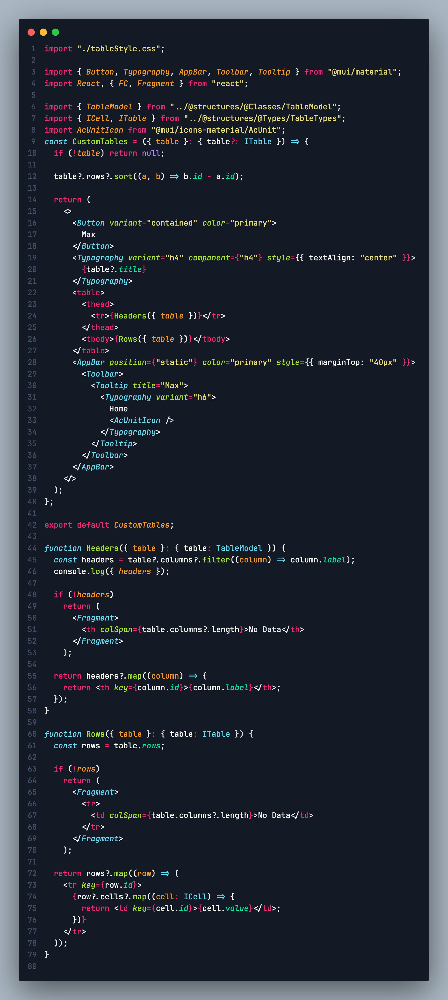
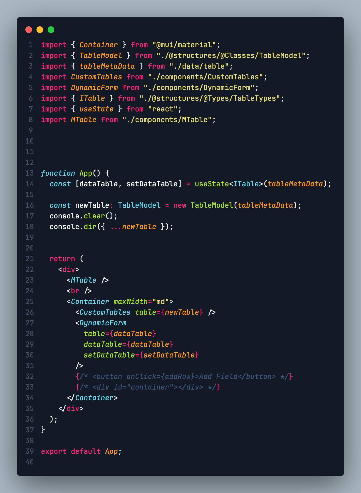

# PhoenixMates - Professional Dark Theme

## Introduction

This is a custom Visual Studio Code theme that combines the best elements from multiple themes to provide clarity and ease of use. It aims to improve readability and reduce confusion by using distinct colors for different elements like objects, variables, constants, functions, classes, attributes, and more.

## Motivation

I found myself frequently switching between themes because while some provided clarity, they often used the same color for different elements, causing confusion. So, I decided to create a custom theme that incorporates my favorite color patterns from the themes I've used in the past.

The result is a theme that is easy on the eyes and makes reading and writing code a breeze. Most importantly, it clearly highlights different syntax elements, making it easy to distinguish between variables, constants, functions, objects, classes, attributes, and more.

## Installation

1. Open the Extensions sidebar in VS Code. `View → Extensions`
2. Search for `PhoenixMates - Professional Dark`, and install it.
3. After installation, open the Command Palette `Ctrl + Shift + P` (`Cmd + Shift + P` on macOS)
4. Select `Preferences: Color Theme`, then choose `PhoenixMates - Professional Dark` from the list.

## Feedback

I hope you find this extension useful. If you have any suggestions or feedback, please feel free to email me at [PhoenixMates@outlook.com](mailto:PhoenixMates@outlook.com).

Enjoy coding 🎉!

**Cheers 🥂**

## For more information

* [Visual Studio Code's Marketplace](https://marketplace.visualstudio.com/items?itemName=PhoenixMatesTechnologiesInc.phoenixmatesprofessionaldark)
* [Github Repository](https://github.com/Anas-Alhariri/PhoenixMates-Professional-Dark)
* [PhoenixMates.ca](https://www.phoenixmates.ca/)

